# grt Design Documentation

Navigation hub for all design documentation. Start here to find what you need.

## Document Lifecycle

Design docs follow a two-stage lifecycle:

1. **`draft/`** — Work in progress. May be incomplete or contain open questions.
2. **`adopted/`** — Implemented and authoritative. Content reflects actual practice.

A doc moves from draft to adopted via `git mv` when its design is implemented. See
`adopted/repo-layout.md` for the full directory structure.

## Document Map

| Path | Purpose | Status |
|------|---------|--------|
| **Adopted** | | |
| `adopted/repo-layout.md` | Repository directory structure — single source of truth | Adopted |
| `adopted/rust-conventions.md` | Rust coding standards | Adopted |
| `adopted/patterns.md` | Pattern library (grows over time) | Adopted |
| `adopted/tech-stack.md` | Technology selections, crate rationale, dependency decisions | Adopted |
| **Reference Specs** | | |
| `ref-specs/gertty-data-model.md` | Gertty SQLAlchemy schema: 18+ tables, relationships, indices | Complete |
| `ref-specs/gertty-sync-system.md` | Gertty sync: priority queue, 30+ task types, offline handling | Complete |
| `ref-specs/gertty-search-language.md` | Gertty search: tokenizer, parser, query semantics | Complete |
| `ref-specs/gertty-config-and-ui.md` | Gertty config, views, navigation, keybindings | Complete |
| `ref-specs/git-review-workflow.md` | git-review push workflow, hooks, rebase, config layers | Complete |
| `ref-specs/git-review-gerrit-api.md` | git-review Gerrit protocols: SSH + HTTP, auth methods | Complete |
| `ref-specs/ca-bhfuil-patterns.md` | ca-bhfuil manager pattern, async, CLI separation | Complete |
| **Design Docs (Draft)** | | |
| `draft/architecture.md` | grt system design, module boundaries, data flow | Draft |
| `draft/build-and-release.md` | Build, CI, cross-compilation, SBOM, signing, release | Draft |
| `draft/data-model.md` | Unified SQLite schema (from gertty + extensions) | Stub |
| `draft/gerrit-client.md` | REST API client, auth, retry, bearer auth, typed errors | Draft |
| `draft/cli-design.md` | clap command tree, review subcommand, busybox argv[0], completions, exit codes | Draft |
| `draft/tui-design.md` | ratatui views, navigation, event loop | Stub |
| `draft/search-engine.md` | Query language + fuzzy search design | Stub |
| `draft/config-system.md` | TOML config, layered config, bearer auth, .git suffix stripping | Draft |
| `draft/git-operations.md` | gix reads, subprocess writes, download, cherry-pick, compare | Draft |
| `draft/sync-engine.md` | Async sync, task scheduling, offline mode | Stub |
| `draft/error-handling.md` | GerritError enum, retry, exit codes, anyhow context | Draft |
| **Decisions** | | |
| `decisions/` | Architecture Decision Records | Index only |

## Traceability Matrix

How reference project analysis feeds into grt design.

| Ref-Spec | Informs Design Doc(s) |
|----------|----------------------|
| gertty-data-model | data-model, sync-engine |
| gertty-sync-system | sync-engine, gerrit-client |
| gertty-search-language | search-engine |
| gertty-config-and-ui | config-system, tui-design |
| git-review-workflow | cli-design, git-operations |
| git-review-gerrit-api | gerrit-client |
| ca-bhfuil-patterns | architecture |

## Reading Paths

**Starting a new module?** Read `draft/architecture.md` first, then the relevant design doc.

**Understanding the repo structure?** Read `adopted/repo-layout.md`.

**Understanding a design decision?** Check `decisions/` for ADRs, then the relevant design doc for context.

**Looking at how the Python projects did it?** Start with `ref-specs/README.md`, then the specific ref-spec.

| Task Area | Read In Order |
|-----------|--------------|
| Data layer | gertty-data-model → draft/data-model → draft/sync-engine |
| Gerrit integration | git-review-gerrit-api → gertty-sync-system → draft/gerrit-client → draft/sync-engine |
| Search | gertty-search-language → draft/search-engine |
| TUI | gertty-config-and-ui → draft/tui-design → draft/architecture |
| CLI | git-review-workflow → draft/cli-design |
| Git operations | git-review-workflow → draft/git-operations |
| Configuration | gertty-config-and-ui → draft/config-system |
| Architecture | ca-bhfuil-patterns → draft/architecture |
| Build & release | draft/build-and-release → adopted/tech-stack (crate context) |

## Relationships

```mermaid
graph TD
    subgraph "Reference Specs (descriptive)"
        GDM[gertty-data-model]
        GSS[gertty-sync-system]
        GSL[gertty-search-language]
        GCU[gertty-config-and-ui]
        GRW[git-review-workflow]
        GRA[git-review-gerrit-api]
        CBP[ca-bhfuil-patterns]
    end

    subgraph "Design Docs (prescriptive)"
        ARCH[architecture]
        TS[tech-stack]
        DM[data-model]
        GC[gerrit-client]
        CLI[cli-design]
        TUI[tui-design]
        SE[search-engine]
        CS[config-system]
        GO[git-operations]
        SYNC[sync-engine]
        EH[error-handling]
        BR[build-and-release]
    end

    GDM --> DM
    GDM --> SYNC
    GSS --> SYNC
    GSS --> GC
    GSL --> SE
    GCU --> CS
    GCU --> TUI
    GRW --> CLI
    GRW --> GO
    GRA --> GC
    CBP --> ARCH

    TS --> ARCH
    TS --> BR

    ARCH --> DM
    ARCH --> GC
    ARCH --> CLI
    ARCH --> TUI
    ARCH --> SE
    ARCH --> CS
    ARCH --> GO
    ARCH --> SYNC
    ARCH --> EH
    ARCH --> BR
```

