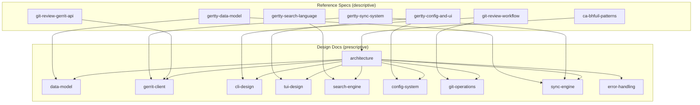

# grt Design Documentation

Navigation hub for all design documentation. Start here to find what you need.

## Document Map

| Path | Purpose | Status |
|------|---------|--------|
| **Reference Specs** | | |
| `ref-specs/gertty-data-model.md` | Gertty SQLAlchemy schema: 18+ tables, relationships, indices | Complete |
| `ref-specs/gertty-sync-system.md` | Gertty sync: priority queue, 30+ task types, offline handling | Complete |
| `ref-specs/gertty-search-language.md` | Gertty search: tokenizer, parser, query semantics | Complete |
| `ref-specs/gertty-config-and-ui.md` | Gertty config, views, navigation, keybindings | Complete |
| `ref-specs/git-review-workflow.md` | git-review push workflow, hooks, rebase, config layers | Complete |
| `ref-specs/git-review-gerrit-api.md` | git-review Gerrit protocols: SSH + HTTP, auth methods | Complete |
| `ref-specs/ca-bhfuil-patterns.md` | ca-bhfuil manager pattern, async, CLI separation | Complete |
| **Design Docs** | | |
| `architecture.md` | grt system design, module boundaries, data flow | Draft |
| `data-model.md` | Unified SQLite schema (from gertty + extensions) | Stub |
| `gerrit-client.md` | REST API client, auth, sync endpoints | Stub |
| `cli-design.md` | clap command tree, flags, output formats | Stub |
| `tui-design.md` | ratatui views, navigation, event loop | Stub |
| `search-engine.md` | Query language + fuzzy search design | Stub |
| `config-system.md` | TOML config, layered config, multi-server | Stub |
| `git-operations.md` | git2 ops, NoteDb reading, hook management | Stub |
| `sync-engine.md` | Async sync, task scheduling, offline mode | Stub |
| `error-handling.md` | Error types, recovery, user-facing messages | Stub |
| **Decisions** | | |
| `decisions/` | Architecture Decision Records | Index only |

## Traceability Matrix

How reference project analysis feeds into grt design.

| Ref-Spec | Informs Design Doc(s) |
|----------|----------------------|
| gertty-data-model | data-model, sync-engine |
| gertty-sync-system | sync-engine, gerrit-client |
| gertty-search-language | search-engine |
| gertty-config-and-ui | config-system, tui-design |
| git-review-workflow | cli-design, git-operations |
| git-review-gerrit-api | gerrit-client |
| ca-bhfuil-patterns | architecture |

## Reading Paths

**Starting a new module?** Read `architecture.md` first, then the relevant design doc.

**Understanding a design decision?** Check `decisions/` for ADRs, then the relevant design doc for context.

**Looking at how the Python projects did it?** Start with `ref-specs/README.md`, then the specific ref-spec.

| Task Area | Read In Order |
|-----------|--------------|
| Data layer | gertty-data-model → data-model → sync-engine |
| Gerrit integration | git-review-gerrit-api → gertty-sync-system → gerrit-client → sync-engine |
| Search | gertty-search-language → search-engine |
| TUI | gertty-config-and-ui → tui-design → architecture |
| CLI | git-review-workflow → cli-design |
| Git operations | git-review-workflow → git-operations |
| Configuration | gertty-config-and-ui → config-system |
| Architecture | ca-bhfuil-patterns → architecture |

## Relationships

