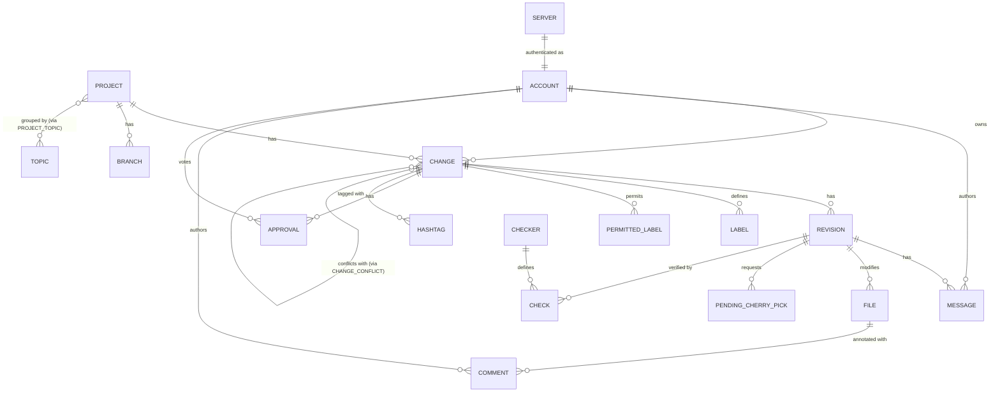

# Gertty Data Model

**Source project:** gertty
**Source files:** `gertty/db.py`, `gertty/dbsupport.py`, `gertty/alembic/`
**Status:** Draft
**Informs:** `data-model.md`, `sync-engine.md`

## Overview

Gertty uses SQLAlchemy's imperative mapping style (formerly "classical mapping") to define a local SQLite cache of Gerrit data. The data model serves as an offline mirror: all Gerrit entities a user cares about are replicated into local tables so the TUI can operate without network access.

The model is defined in a single file (`db.py`) using three layers:

1. **Table definitions** -- `sqlalchemy.Table` objects bound to a shared `MetaData` instance. These define columns, types, foreign keys, and indices declaratively.
2. **Plain Python classes** -- simple classes (no ORM base class) that hold constructor logic, convenience methods, and computed properties.
3. **Imperative mapper calls** -- `mapper.map_imperatively()` binds each class to its table and declares relationships (one-to-many, many-to-many, filtered views).

This three-layer separation keeps the schema definition readable and the domain objects free of ORM inheritance. The `Database` class wraps engine creation, session management (scoped sessions with a threading lock), and migration execution. A `DatabaseSession` context manager acquires the lock on entry, commits or rolls back on exit, and logs how long the lock was held.

A notable design pattern throughout the model is the use of `pending_*` boolean columns on the `change` table. These flags track local mutations that have not yet been pushed to the Gerrit server (e.g., a topic change, a status change, a rebase request). The sync engine reads these flags to know what to upload. This pattern gives the offline-first design its teeth: the user can make changes locally, and the sync system reconciles them later.

The model defines a custom `matches()` SQL function registered on every SQLite connection to support regex-based search queries within SQLAlchemy's query builder.

## Tables

Gertty's final schema contains 18 tables. They fall into three categories: core review data, junction/association tables, and metadata/infrastructure tables.

### Core Tables

#### `project`

The top-level organizational unit. Each Gerrit project (repository) that the user has subscribed to or that contains relevant changes gets a row here.

| Column       | Type         | Constraints                        |
| ------------ | ------------ | ---------------------------------- |
| `key`        | Integer      | PRIMARY KEY                        |
| `name`       | String(255)  | NOT NULL, UNIQUE, INDEX            |
| `subscribed` | Boolean      | INDEX, default `False`             |
| `description`| Text         | NOT NULL, default `''`             |
| `updated`    | DateTime     | INDEX (nullable)                   |

`subscribed` controls whether the sync engine actively polls for new changes in this project. `updated` tracks the last sync timestamp.

#### `change`

The central table of the model. Represents a single Gerrit change (a code review unit). This table is heavily indexed because the TUI's change list views filter and sort on many columns.

| Column                   | Type         | Constraints                        |
| ------------------------ | ------------ | ---------------------------------- |
| `key`                    | Integer      | PRIMARY KEY                        |
| `project_key`            | Integer      | FK -> `project.key`, INDEX         |
| `id`                     | String(255)  | NOT NULL, UNIQUE, INDEX            |
| `number`                 | Integer      | NOT NULL, UNIQUE, INDEX            |
| `branch`                 | String(255)  | NOT NULL, INDEX                    |
| `change_id`              | String(255)  | NOT NULL, INDEX                    |
| `topic`                  | String(255)  | INDEX (nullable)                   |
| `account_key`            | Integer      | FK -> `account.key`, INDEX         |
| `subject`                | Text         | NOT NULL                           |
| `created`                | DateTime     | NOT NULL, INDEX                    |
| `updated`                | DateTime     | NOT NULL, INDEX                    |
| `status`                 | String(16)   | NOT NULL, INDEX                    |
| `hidden`                 | Boolean      | NOT NULL, INDEX                    |
| `reviewed`               | Boolean      | NOT NULL, INDEX                    |
| `starred`                | Boolean      | NOT NULL, INDEX                    |
| `held`                   | Boolean      | NOT NULL, INDEX                    |
| `wip`                    | Boolean      | NOT NULL, INDEX                    |
| `outdated`               | Boolean      | NOT NULL, INDEX                    |
| `last_seen`              | DateTime     | INDEX (nullable)                   |
| `pending_rebase`         | Boolean      | NOT NULL, INDEX                    |
| `pending_topic`          | Boolean      | NOT NULL, INDEX                    |
| `pending_starred`        | Boolean      | NOT NULL, INDEX                    |
| `pending_status`         | Boolean      | NOT NULL, INDEX                    |
| `pending_hashtags`       | Boolean      | NOT NULL, INDEX                    |
| `pending_wip`            | Boolean      | NOT NULL, INDEX                    |
| `pending_status_message` | Text         | (nullable)                         |
| `pending_wip_message`    | Text         | (nullable)                         |

Key observations:
- `id` is Gerrit's internal change ID string (e.g., `myproject~master~I1234...`). `number` is the human-visible change number. `change_id` is the Change-Id from the commit message. All three are indexed.
- `hidden` and `reviewed` are local-only flags not synced back to Gerrit. They control the TUI's display filtering.
- `starred` and `held` are user-controlled flags. `starred` is synced to Gerrit; `held` is local-only.
- The seven `pending_*` columns form the offline mutation queue. Each boolean indicates that the corresponding field has been modified locally and awaits upload.
- `status` values match Gerrit's: `NEW`, `MERGED`, `ABANDONED`.
- `outdated` signals that the change needs to be re-fetched from the server.

#### `revision`

A patchset within a change. Gerrit numbers patchsets starting at 1.

| Column            | Type         | Constraints                        |
| ----------------- | ------------ | ---------------------------------- |
| `key`             | Integer      | PRIMARY KEY                        |
| `change_key`      | Integer      | FK -> `change.key`, INDEX          |
| `number`          | Integer      | NOT NULL, INDEX                    |
| `message`         | Text         | NOT NULL                           |
| `commit`          | String(255)  | NOT NULL, INDEX                    |
| `parent`          | String(255)  | NOT NULL, INDEX                    |
| `fetch_auth`      | Boolean      | NOT NULL                           |
| `fetch_ref`       | String(255)  | NOT NULL                           |
| `pending_message` | Boolean      | NOT NULL, INDEX                    |
| `can_submit`      | Boolean      | NOT NULL                           |

`commit` and `parent` store SHA-1 hashes. `fetch_ref` is the Gerrit ref (e.g., `refs/changes/42/1042/3`). The source code notes that `fetch_auth` and `fetch_ref` are unused and candidates for removal. `pending_message` indicates a locally-edited commit message awaiting upload.

#### `message`

Review messages (top-level comments on a patchset, not inline file comments).

| Column         | Type         | Constraints                        |
| -------------- | ------------ | ---------------------------------- |
| `key`          | Integer      | PRIMARY KEY                        |
| `revision_key` | Integer      | FK -> `revision.key`, INDEX        |
| `account_key`  | Integer      | FK -> `account.key`, INDEX         |
| `id`           | String(255)  | INDEX (nullable)                   |
| `created`      | DateTime     | NOT NULL, INDEX                    |
| `message`      | Text         | NOT NULL                           |
| `draft`        | Boolean      | NOT NULL, INDEX                    |
| `pending`      | Boolean      | NOT NULL, INDEX                    |

`draft` indicates the message has not been published yet. `pending` indicates it was created locally and needs to be synced to Gerrit. The `id` column is nullable because locally-created drafts do not yet have a server-assigned ID.

#### `file`

Files modified in a revision. This table was added in a later migration to support file-level diff stats and to serve as the parent for inline comments.

| Column         | Type         | Constraints                        |
| -------------- | ------------ | ---------------------------------- |
| `key`          | Integer      | PRIMARY KEY                        |
| `revision_key` | Integer      | FK -> `revision.key`, INDEX        |
| `path`         | Text         | NOT NULL, INDEX                    |
| `old_path`     | Text         | INDEX (nullable)                   |
| `inserted`     | Integer      | (nullable)                         |
| `deleted`      | Integer      | (nullable)                         |
| `status`       | String(1)    | NOT NULL                           |

`status` uses single-character codes defined in the `File` class:

```python
STATUS_ADDED = 'A'
STATUS_DELETED = 'D'
STATUS_RENAMED = 'R'
STATUS_COPIED = 'C'
STATUS_REWRITTEN = 'W'
STATUS_MODIFIED = 'M'
```

`old_path` is populated only for renames/copies. `inserted` and `deleted` are line counts from diffstat output.

#### `comment`

Inline comments attached to specific lines in files.

| Column         | Type         | Constraints                        |
| -------------- | ------------ | ---------------------------------- |
| `key`          | Integer      | PRIMARY KEY                        |
| `file_key`     | Integer      | FK -> `file.key`, INDEX            |
| `account_key`  | Integer      | FK -> `account.key`, INDEX         |
| `id`           | String(255)  | INDEX (nullable)                   |
| `in_reply_to`  | String(255)  | (nullable)                         |
| `created`      | DateTime     | NOT NULL, INDEX                    |
| `parent`       | Boolean      | NOT NULL                           |
| `line`         | Integer      | (nullable)                         |
| `message`      | Text         | NOT NULL                           |
| `draft`        | Boolean      | NOT NULL, INDEX                    |
| `robot_id`     | String(255)  | (nullable)                         |
| `robot_run_id` | String(255)  | (nullable)                         |
| `url`          | Text         | (nullable)                         |

`parent` indicates whether the comment is on the parent side of the diff (base) or the patchset side. `in_reply_to` links to another comment's `id` to form threads. Robot comment fields (`robot_id`, `robot_run_id`, `url`) were added to support Gerrit's robot/automated comments feature. Comments were originally attached directly to revisions; a migration moved them to be children of files instead.

#### `label`

The possible label values defined for a change (e.g., Code-Review can be -2, -1, 0, +1, +2).

| Column       | Type         | Constraints                        |
| ------------ | ------------ | ---------------------------------- |
| `key`        | Integer      | PRIMARY KEY                        |
| `change_key` | Integer      | FK -> `change.key`, INDEX          |
| `category`   | String(255)  | NOT NULL                           |
| `value`      | Integer      | NOT NULL                           |
| `description`| String(255)  | NOT NULL                           |

Each row represents one possible value for a label category on a specific change. For example, a Code-Review label allowing -2 to +2 would produce five rows.

#### `permitted_label`

The label values the current user is permitted to apply.

| Column       | Type         | Constraints                        |
| ------------ | ------------ | ---------------------------------- |
| `key`        | Integer      | PRIMARY KEY                        |
| `change_key` | Integer      | FK -> `change.key`, INDEX          |
| `category`   | String(255)  | NOT NULL                           |
| `value`      | Integer      | NOT NULL                           |

Same structure as `label` but without `description`, representing what the authenticated user is allowed to vote.

#### `approval`

Actual votes cast on changes.

| Column        | Type         | Constraints                        |
| ------------- | ------------ | ---------------------------------- |
| `key`         | Integer      | PRIMARY KEY                        |
| `change_key`  | Integer      | FK -> `change.key`, INDEX          |
| `account_key` | Integer      | FK -> `account.key`, INDEX         |
| `category`    | String(255)  | NOT NULL                           |
| `value`       | Integer      | NOT NULL                           |
| `draft`       | Boolean      | NOT NULL, INDEX                    |

`draft` indicates a locally-created vote that has not been published. The `Change` class provides `_updateApprovalCache()` to compute the most significant vote per category (the value with the largest absolute magnitude).

#### `account`

Gerrit user accounts. Referenced by changes (owner), messages (author), comments (author), and approvals (reviewer).

| Column     | Type         | Constraints                        |
| ---------- | ------------ | ---------------------------------- |
| `key`      | Integer      | PRIMARY KEY                        |
| `id`       | Integer      | NOT NULL, UNIQUE, INDEX            |
| `name`     | String(255)  | INDEX (nullable)                   |
| `username` | String(255)  | INDEX (nullable)                   |
| `email`    | String(255)  | INDEX (nullable)                   |

`id` is Gerrit's numeric account ID. `name`, `username`, and `email` are all nullable because Gerrit accounts may have only some of these fields populated. The `getAccountByID` method in `DatabaseSession` uses an upsert pattern: it creates the account if it does not exist and updates any changed fields.

#### `checker`

Gerrit Checks plugin checker definitions.

| Column        | Type         | Constraints                        |
| ------------- | ------------ | ---------------------------------- |
| `key`         | Integer      | PRIMARY KEY                        |
| `uuid`        | String(255)  | NOT NULL, UNIQUE, INDEX            |
| `name`        | String(255)  | NOT NULL                           |
| `status`      | String(255)  | NOT NULL                           |
| `blocking`    | String(255)  | (nullable)                         |
| `description` | Text         | (nullable)                         |

#### `check`

Individual check results attached to revisions by a checker.

| Column         | Type         | Constraints                        |
| -------------- | ------------ | ---------------------------------- |
| `key`          | Integer      | PRIMARY KEY                        |
| `revision_key` | Integer      | FK -> `revision.key`, INDEX        |
| `checker_key`  | Integer      | FK -> `checker.key`, INDEX         |
| `state`        | String(255)  | NOT NULL                           |
| `url`          | Text         | (nullable)                         |
| `message`      | Text         | (nullable)                         |
| `started`      | DateTime     | (nullable)                         |
| `finished`     | DateTime     | (nullable)                         |
| `created`      | DateTime     | NOT NULL, INDEX                    |
| `updated`      | DateTime     | NOT NULL, INDEX                    |

### Relationship Tables

#### `change_conflict`

A self-referential many-to-many join table linking pairs of changes that conflict with each other.

| Column        | Type    | Constraints                        |
| ------------- | ------- | ---------------------------------- |
| `key`         | Integer | PRIMARY KEY                        |
| `change1_key` | Integer | FK -> `change.key`, INDEX          |
| `change2_key` | Integer | FK -> `change.key`, INDEX          |

The relationship is symmetric: if change A conflicts with change B, a single row exists with `change1_key=A, change2_key=B`. The `Change` class exposes `conflicts1` and `conflicts2` relationships and a `conflicts` property that unions both directions. The `Project.delete()` method contains a special workaround to delete changes one at a time to avoid SQLAlchemy double-deleting conflict rows during cascades.

#### `project_topic`

A many-to-many join table between projects and user-defined topic groups (not Gerrit topics). Topics are a local organizational concept for grouping projects in the TUI.

| Column        | Type    | Constraints                                      |
| ------------- | ------- | ------------------------------------------------ |
| `key`         | Integer | PRIMARY KEY                                      |
| `project_key` | Integer | FK -> `project.key`, INDEX                       |
| `topic_key`   | Integer | FK -> `topic.key`, INDEX                         |
| `sequence`    | Integer | NOT NULL, UNIQUE with `topic_key`                |

The `sequence` column controls display order of projects within a topic. The unique constraint on `(topic_key, sequence)` prevents ordering collisions.

#### `hashtag`

Tags attached to changes (Gerrit hashtags feature).

| Column       | Type         | Constraints                        |
| ------------ | ------------ | ---------------------------------- |
| `key`        | Integer      | PRIMARY KEY                        |
| `change_key` | Integer      | FK -> `change.key`, INDEX          |
| `name`       | String(255)  | NOT NULL, INDEX                    |

Modeled as a one-to-many child of `change` rather than a separate many-to-many, since hashtags are simple string labels.

### Metadata Tables

#### `server`

A singleton table storing server-level configuration. Contains only the authenticated user's account reference.

| Column            | Type    | Constraints                        |
| ----------------- | ------- | ---------------------------------- |
| `key`             | Integer | PRIMARY KEY                        |
| `own_account_key` | Integer | FK -> `account.key`, INDEX         |

The `DatabaseSession.setOwnAccount()` and `getOwnAccount()` methods manage this singleton.

#### `topic`

User-defined groupings for organizing projects in the TUI. Not to be confused with Gerrit change topics (stored as a string column on the `change` table).

| Column     | Type         | Constraints                        |
| ---------- | ------------ | ---------------------------------- |
| `key`      | Integer      | PRIMARY KEY                        |
| `name`     | String(255)  | NOT NULL, INDEX                    |
| `sequence` | Integer      | NOT NULL, UNIQUE, INDEX            |

`sequence` controls display ordering in the project list.

#### `branch`

Branches within a project, used to populate cherry-pick target selection.

| Column        | Type         | Constraints                        |
| ------------- | ------------ | ---------------------------------- |
| `key`         | Integer      | PRIMARY KEY                        |
| `project_key` | Integer      | FK -> `project.key`, INDEX         |
| `name`        | String(255)  | NOT NULL, INDEX                    |

#### `pending_cherry_pick`

Locally-requested cherry-pick operations awaiting sync to the server.

| Column         | Type         | Constraints                        |
| -------------- | ------------ | ---------------------------------- |
| `key`          | Integer      | PRIMARY KEY                        |
| `revision_key` | Integer      | FK -> `revision.key`, INDEX        |
| `branch`       | String(255)  | NOT NULL                           |
| `message`      | Text         | NOT NULL                           |

`branch` is stored as a plain string rather than a foreign key to `branch.key` to avoid complications if the branch entry is removed before the cherry-pick syncs.

#### `sync_query`

Named queries whose results are periodically synced from the server.

| Column    | Type         | Constraints                        |
| --------- | ------------ | ---------------------------------- |
| `key`     | Integer      | PRIMARY KEY                        |
| `name`    | String(255)  | NOT NULL, UNIQUE, INDEX            |
| `updated` | DateTime     | INDEX (nullable)                   |

`updated` records when the query was last synced, enabling incremental polling.

## Relationships

The following diagram shows the entity-relationship structure. All foreign keys use integer surrogate keys. Cascade deletes flow from parent to child (marked `all, delete-orphan` in the mapper configuration).



### Relationship Details from ORM Mapper

The imperative mapper calls configure these relationship properties:

**Project:**
- `branches` -- one-to-many to Branch, ordered by name, cascade delete-orphan
- `changes` -- one-to-many to Change, ordered by number, cascade delete-orphan
- `topics` -- many-to-many to Topic via `project_topic`, ordered by name, viewonly
- `unreviewed_changes` -- filtered relationship: `hidden=False AND status NOT IN ('MERGED', 'ABANDONED') AND reviewed=False`
- `open_changes` -- filtered relationship: `status NOT IN ('MERGED', 'ABANDONED')`

**Change:**
- `owner` -- many-to-one to Account
- `revisions` -- one-to-many to Revision, ordered by number, cascade delete-orphan
- `messages` -- read-through relationship via `revision` secondary table (viewonly), ordered by created
- `labels`, `permitted_labels`, `approvals` -- one-to-many, ordered by (category, value), cascade delete-orphan
- `draft_approvals` -- filtered relationship where `draft=True`
- `hashtags` -- one-to-many to Hashtag, cascade delete-orphan
- `conflicts1`, `conflicts2` -- self-referential many-to-many via `change_conflict`

**Revision:**
- `messages` -- one-to-many to Message, cascade delete-orphan
- `files` -- one-to-many to File, cascade delete-orphan
- `pending_cherry_picks` -- one-to-many to PendingCherryPick, cascade delete-orphan
- `checks` -- one-to-many to Check, cascade delete-orphan

**File:**
- `comments` -- one-to-many to Comment, ordered by (line, created), cascade delete-orphan
- `draft_comments` -- filtered relationship where `draft=True`

**Message, Comment, Approval:**
- `author` / `reviewer` -- many-to-one to Account

**Server:**
- `own_account` -- many-to-one to Account

**Check:**
- `checker` -- many-to-one to Checker

## Indices

Gertty indexes aggressively. Nearly every column that appears in a WHERE clause or ORDER BY gets its own index. The naming convention is `ix_{table}_{column}`.

### Foreign Key Indices

Every foreign key column is indexed. This is critical for cascade delete performance in SQLite and for join queries:

- `ix_change_project_key`, `ix_change_account_key`
- `ix_revision_change_key`
- `ix_message_revision_key`, `ix_message_account_key`
- `ix_file_revision_key`
- `ix_comment_file_key`, `ix_comment_account_key`
- `ix_label_change_key`, `ix_permitted_label_change_key`
- `ix_approval_change_key`, `ix_approval_account_key`
- `ix_branch_project_key`
- `ix_project_topic_project_key`, `ix_project_topic_topic_key`
- `ix_hashtag_change_key`
- `ix_pending_cherry_pick_revision_key`
- `ix_check_revision_key`, `ix_check_checker_key`
- `ix_server_own_account_key`

### Unique Indices

- `ix_project_name` (unique) -- lookup by project name
- `ix_change_id` (unique) -- lookup by Gerrit internal ID
- `ix_change_number` (unique) -- lookup by change number
- `ix_account_id` (unique) -- lookup by Gerrit account ID
- `ix_sync_query_name` (unique) -- lookup by query name
- `ix_checker_uuid` (unique) -- lookup by checker UUID
- `ix_topic_sequence` (unique) -- ordering constraint

### Filter/Sort Indices

These support the TUI's change list views and the sync engine's pending-work queries:

- `ix_project_subscribed` -- filter subscribed projects
- `ix_project_updated` -- sort/filter by sync time
- `ix_change_branch`, `ix_change_change_id`, `ix_change_topic` -- search filters
- `ix_change_created`, `ix_change_updated`, `ix_change_last_seen` -- sort columns
- `ix_change_status`, `ix_change_hidden`, `ix_change_reviewed` -- view filters
- `ix_change_starred`, `ix_change_held`, `ix_change_wip`, `ix_change_outdated` -- flag filters
- `ix_change_pending_rebase`, `ix_change_pending_topic`, `ix_change_pending_starred`, `ix_change_pending_status`, `ix_change_pending_hashtags`, `ix_change_pending_wip` -- sync engine queries for pending work
- `ix_revision_number`, `ix_revision_commit`, `ix_revision_parent` -- revision lookups
- `ix_message_created`, `ix_message_id`, `ix_message_draft`, `ix_message_pending` -- message queries
- `ix_comment_created`, `ix_comment_id`, `ix_comment_draft` -- comment queries
- `ix_approval_draft` -- draft approval filter
- `ix_check_created`, `ix_check_updated` -- check sorting
- `ix_branch_name`, `ix_hashtag_name`, `ix_topic_name`, `ix_account_name`, `ix_account_username`, `ix_account_email` -- name lookups

### Index Count

The `change` table alone carries over 20 indices, which is the most heavily indexed table. This reflects its role as the primary query target for the TUI -- every boolean flag and date column is individually indexed to support the search and filter system.

## Migrations

### Framework

Gertty uses [Alembic](https://alembic.sqlalchemy.org/) for schema migrations. The migration chain spans 25 versions, from the initial schema (`44402069e137`, created 2014-05-04) through the latest additions (checks support, WIP flag, etc.).

### Bootstrap Logic

The `Database.migrate()` method handles both fresh databases and upgrades:

```python
def migrate(self, app):
    conn = self.engine.connect()
    context = alembic.migration.MigrationContext.configure(conn)
    current_rev = context.get_current_revision()

    has_table = self.engine.dialect.has_table(conn, "project")

    config = alembic.config.Config()
    config.set_main_option("script_location", "gertty:alembic")
    config.set_main_option("sqlalchemy.url", self.dburi)
    config.gertty_app = app

    if current_rev is None and has_table:
        self.log.debug('Stamping database as initial revision')
        alembic.command.stamp(config, "44402069e137")
    alembic.command.upgrade(config, 'head')
```

If Alembic has no revision recorded but the `project` table exists, the database predates Alembic integration and gets stamped at the initial revision. Then `upgrade` runs all subsequent migrations. For fresh databases, `upgrade` runs the full chain.

### Migration Patterns

The migrations demonstrate several recurring patterns, particularly for working around SQLite's limited ALTER TABLE support:

**Pattern 1: Add nullable column, backfill, alter to NOT NULL.** SQLite cannot add a NOT NULL column without a default. Gertty works around this by adding the column as nullable, populating existing rows, then using `sqlite_alter_columns` to recreate the table with the NOT NULL constraint:

```python
# From 399c4b3dcc9a (add hashtags)
with warnings.catch_warnings():
    warnings.simplefilter("ignore")
    op.add_column('change', sa.Column('pending_hashtags', sa.Boolean()))

connection = op.get_bind()
change = sa.sql.table('change', sa.sql.column('pending_hashtags', sa.Boolean()))
connection.execute(change.update().values({'pending_hashtags': False}))

sqlite_alter_columns('change', [
    sa.Column('pending_hashtags', sa.Boolean(), index=True, nullable=False),
])
```

**Pattern 2: Table recreation for column changes (`dbsupport.py`).** Because SQLite does not support `ALTER COLUMN` or `DROP COLUMN`, `dbsupport.py` provides two helper functions:

- `sqlite_alter_columns(table_name, column_defs)` -- creates a temp table with modified column definitions, copies data, drops the original, renames the temp table, and recreates indices.
- `sqlite_drop_columns(table_name, drop_columns)` -- same temp-table dance but omitting specified columns.

Both functions carefully preserve foreign keys and indices that are not affected by the change.

**Pattern 3: Data migration alongside schema changes.** Some migrations perform substantial data transformation. The `add_files_table` migration (`50344aecd1c2`) is particularly notable -- it creates the `file` table and then iterates over every revision to compute diffstats from the local git repository, populating file entries. The `attach_comments_to_files` migration (`254ac5fc3941`) reparents all existing comments from revisions to files.

**Pattern 4: No downgrades.** Every migration's `downgrade()` function is a no-op (`pass`). Gertty does not support schema rollback.

### Migration Chain (Chronological)

| Revision         | Date       | Description                                      |
| ---------------- | ---------- | ------------------------------------------------ |
| `44402069e137`   | 2014-05-04 | Initial schema (project, change, revision, message, comment, label, permitted_label, approval) |
| `725816dc500`    | 2014-05    | Add fetch_ref column to revision                 |
| `4cc9c46f9d8b`   | 2014-07-23 | Add account table; refactor owner/name to FK     |
| `2a11dd14665`    | 2014-08    | Fix account table indices                        |
| `3d429503a29a`   | 2014-08-30 | Add draft fields to message, comment, approval   |
| `46b175bfa277`   | 2014-08-31 | Add pending actions, branch table, pending_cherry_pick |
| `4a802b741d2f`   | 2014       | Add starred flag to change                       |
| `3cc7e3753dc3`   | 2015       | Add hold flag to change                          |
| `1bb187bcd401`   | 2015-03-26 | Add sync_query table                             |
| `50344aecd1c2`   | 2015-04-13 | Add file table with diffstat population          |
| `254ac5fc3941`   | 2015-04-13 | Attach comments to files (reparenting)           |
| `4388de50824a`   | 2015-10-31 | Add topic and project_topic tables               |
| `3610c2543e07`   | 2016-02-05 | Add change_conflict table                        |
| `37a702b7f58e`   | --         | Add last_seen column to change                   |
| `38104b4c1b84`   | --         | Add project updated column                       |
| `1cdd4e2e74c`    | --         | Add revision commit/parent indices               |
| `56e48a4a064a`   | --         | Increase status field width (8 -> 16)            |
| `312cd5a9f878`   | --         | Add can_submit column to revision                |
| `7ef7dfa2ca3a`   | --         | Add change outdated flag                         |
| `399c4b3dcc9a`   | 2019-08-24 | Add hashtag table and pending_hashtags            |
| `a18731009699`   | 2019-08-28 | Add server table                                 |
| `02ca927a2b55`   | --         | Fix server table FK                              |
| `6f6183367a8f`   | 2020-02-20 | Add robot comment fields                         |
| `45d33eccc7a7`   | 2020-02-20 | Add checker and check tables                     |
| `ad440301e47f`   | 2020-12-18 | Add WIP flag and pending_wip                     |

### Schema Evolution Summary

The initial schema was minimal: project, change, revision, message, comment, label, permitted_label, and approval. Owner identity was a plain string. Over 25 migrations, the schema grew to 18 tables by:

1. **Normalizing accounts** -- the `account` table replaced inline name strings on change, message, comment, and approval
2. **Adding offline mutation tracking** -- `pending_*` columns and the `pending_cherry_pick` table
3. **Enriching the file model** -- the `file` table was inserted between revision and comment, and comments were reparented
4. **Adding organizational features** -- topics, hashtags, branch lists
5. **Adding CI integration** -- checker and check tables
6. **Adding UI state columns** -- starred, held, hidden, reviewed, last_seen, wip, outdated

## grt Divergences

### Type System: Rust/SQLite vs Python/SQLAlchemy

Gertty uses SQLAlchemy's type abstraction (`Integer`, `String(255)`, `Boolean`, `DateTime`, `Text`), which maps to SQLite's dynamic type system at runtime. grt will use `rusqlite` or `sqlx` with explicit SQLite types:

| SQLAlchemy Type  | SQLite Storage | Rust Type             |
| ---------------- | -------------- | --------------------- |
| `Integer`        | INTEGER        | `i64`                 |
| `String(255)`    | TEXT           | `String`              |
| `Text`           | TEXT           | `String`              |
| `Boolean`        | INTEGER (0/1)  | `bool`                |
| `DateTime`       | TEXT (ISO8601) | `chrono::NaiveDateTime` or `time::OffsetDateTime` |

SQLite does not enforce `String(255)` length limits. grt can omit artificial length constraints and validate at the application layer if needed.

### ORM vs Direct SQL

Gertty's imperative mapper provides automatic relationship loading, dirty tracking, identity maps, and cascading deletes. grt will not have an ORM. Key implications:

- **Relationships** must be loaded explicitly with JOIN queries or sequential lookups. The convenient `change.revisions`, `file.comments` navigation will become explicit query functions.
- **Cascade deletes** will be implemented via `ON DELETE CASCADE` foreign key constraints in the schema DDL (SQLite supports this with `PRAGMA foreign_keys = ON`). Gertty relies on SQLAlchemy's in-memory cascade, which is why it needs the special `Project.delete()` workaround for the self-referential conflict table. SQLite's native cascading avoids this problem.
- **Filtered relationships** like `unreviewed_changes`, `draft_approvals`, and `draft_comments` will become named query functions rather than ORM relationship properties.

### Compile-Time Checking

If grt uses `sqlx`, queries can be checked against the schema at compile time. This replaces SQLAlchemy's runtime type checking and provides stronger guarantees. If grt uses `rusqlite`, queries are string-based but typed at the extraction point via `row.get::<_, T>(index)`.

### Schema Simplifications

Potential simplifications for grt:

- **Remove `fetch_auth` and `fetch_ref`** from the revision table. The gertty source code itself notes these are unused.
- **Consolidate `label` and `permitted_label`** if the distinction is not needed for grt's UI.
- **Replace `pending_*` booleans** with a dedicated pending operations table. Instead of seven boolean columns on `change` plus `pending_message` on `revision`, a single `pending_operation(entity_type, entity_key, operation_type, payload)` table would be more extensible and reduce index count on the change table.
- **Use a proper enum column** for `change.status` and `file.status` via CHECK constraints rather than free-form strings.
- **Add `server_id`** if grt supports multiple Gerrit servers in a single database. Gertty's model is single-server (the `server` table is a singleton).

### Schema Extensions

Features grt may need that gertty does not have:

- **Multi-server support** -- a `server` table with connection details and a `server_key` FK on `project` and `account`.
- **Related changes** -- gertty tracks conflicts but not the full depends-on/needed-by graph. A `change_dependency` table could model this.
- **Attention set** -- Gerrit's attention set tracking, which gertty predates.
- **Submit requirements** -- structured submit requirement results (Gerrit 3.5+), replacing the simple `can_submit` boolean.

### Migration Strategy

Gertty uses Alembic with SQLite-specific workarounds for ALTER COLUMN and DROP COLUMN. grt will likely use a simpler migration approach:

- Embed migration SQL in the binary (as string constants or via `include_str!`)
- Track the current schema version in a `schema_version` table or SQLite's `user_version` pragma
- Apply migrations sequentially at startup
- Since grt starts fresh (no legacy schema), the initial migration can define the full schema without accumulating 25 incremental migrations
